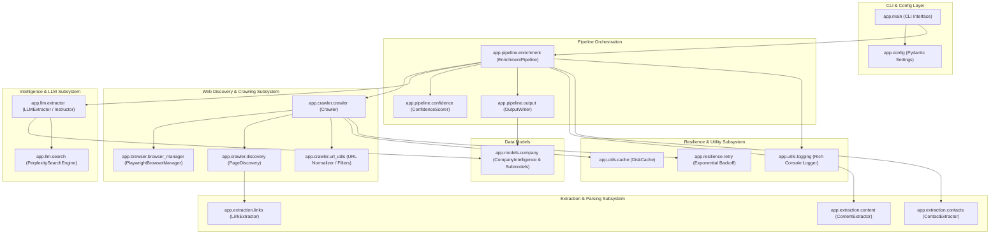
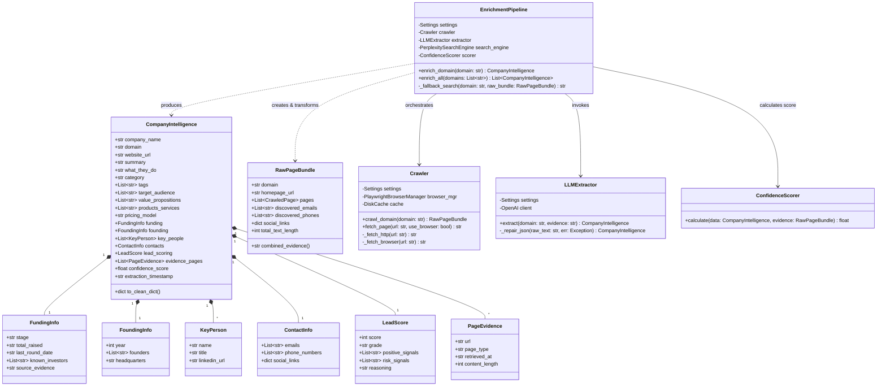
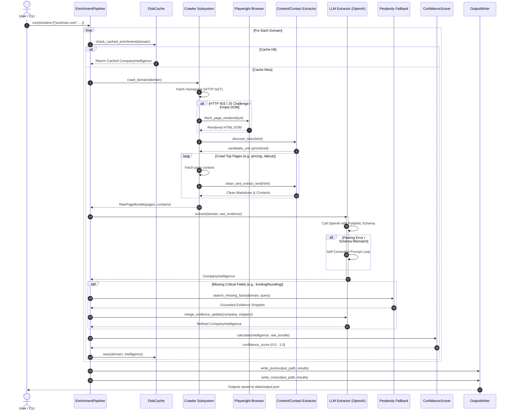
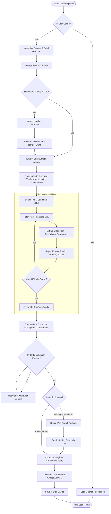
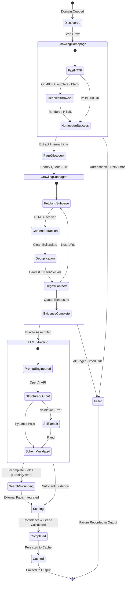
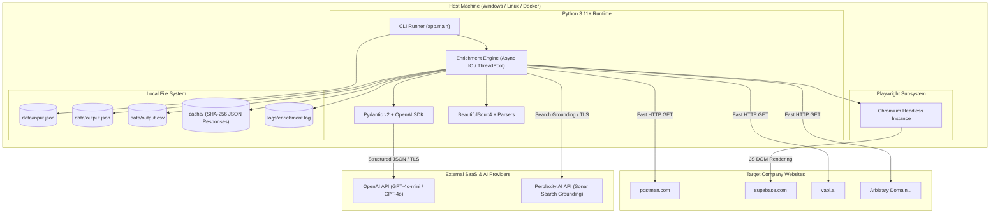

# Autonomous Lead Enrichment Pipeline

> **Production-grade, modular Python pipeline that autonomously crawls company websites, extracts structured business intelligence using an LLM, validates data with strict Pydantic schemas, and outputs clean lead intelligence.** Built for the AI Engineer Intern take-home assignment with zero hardcoded company rules.

[](https://www.python.org/)
[](https://docs.pydantic.dev/)
[](https://playwright.dev/)
[](https://platform.openai.com/)
[]()
[]()

---

## Table of Contents

1. [Assignment Requirements & Fulfillment Matrix](#1-assignment-requirements--fulfillment-matrix)
2. [System Architecture & UML Diagrams](#2-system-architecture--uml-diagrams)
   - [2.1 Component Diagram](#21-component-diagram-system-architecture)
   - [2.2 Class Diagram](#22-class-diagram-domain-model--pipeline)
   - [2.3 Sequence Diagram](#23-sequence-diagram-end-to-end-flow)
   - [2.4 Activity Diagram](#24-activity-diagram-crawling--extraction-logic)
   - [2.5 State Machine Diagram](#25-state-machine-diagram-lead-processing-lifecycle)
   - [2.6 Deployment Diagram](#26-deployment-diagram-runtime--infrastructure)
3. [Key Engineering Highlights](#3-key-engineering-highlights)
4. [Project Structure](#4-project-structure)
5. [Installation & Setup](#5-installation--setup)
6. [CLI Usage](#6-cli-usage)
7. [Input & Output Specification](#7-input--output-specification)
8. [Confidence Scoring & Lead Grading](#8-confidence-scoring--lead-grading)
9. [Testing & Quality Assurance](#9-testing--quality-assurance)
10. [Loom Demo Script (2–3 Minute Guide)](#10-loom-demo-script-23-minute-guide)
11. [Responsible Crawling & Safety Policies](#11-responsible-crawling--safety-policies)

---

## 1. Assignment Requirements & Fulfillment Matrix

| Assignment Requirement | Implementation Detail | Status |
|---|---|:---:|
| **Autonomous Domain Navigation** | Accepts domain list (`postman.com`, `supabase.com`, `vapi.ai`, or arbitrary domains), resolves root URLs, and auto-discovers relevant paths. | ✅ **Satisfied** |
| **Hybrid Crawling Architecture** | Fast `httpx` HTTP retrieval with automatic fallback to headless **Playwright Chromium** for JavaScript SPAs / Cloudflare bot blocks. | ✅ **Satisfied** |
| **Heuristic Page Prioritization** | Scores and ranks internal links (e.g. `/about`, `/pricing`, `/products`, `/contact`) to fetch high-value pages first within a bounded budget. | ✅ **Satisfied** |
| **Content Cleaning & Deduplication** | Strips scripts, SVGs, styles, navbars, footers, cookie banners, and removes cross-page duplicate paragraphs using exact hashing. | ✅ **Satisfied** |
| **Deterministic Contact Extraction** | Scans raw HTML/text using RFC-compliant regex for emails, phone numbers, and social links (LinkedIn, X/Twitter, GitHub, YouTube). | ✅ **Satisfied** |
| **Structured LLM Extraction** | OpenAI `gpt-4o-mini` / `gpt-4o` using Pydantic schema validation with automatic JSON repair loop for schema self-correction. | ✅ **Satisfied** |
| **External Search Grounding** | Optional Perplexity AI integration (`sonar` search) to enrich missing funding, founders, or headquarters with cited web evidence. | ✅ **Satisfied** |
| **Calibrated Confidence Scoring** | Multi-factor objective score (0.0 to 1.0) based on page coverage, deterministic evidence, and field completeness with letter grades (A–D). | ✅ **Satisfied** |
| **JSON & CSV Output** | Formats final structured intelligence to `data/output.json` with metadata, evidence links, and execution metrics. | ✅ **Satisfied** |
| **Comprehensive Test Suite** | **94 unit tests** covering URL normalization, discovery, regex parsing, content dedup, models, and pipeline logic. | ✅ **Satisfied** |

---

## 2. System Architecture & UML Diagrams

### 2.1 Component Diagram (System Architecture)



---

### 2.2 Class Diagram (Domain Model & Pipeline)



---

### 2.3 Sequence Diagram (End-to-End Flow)



---

### 2.4 Activity Diagram (Crawling & Extraction Logic)



---

### 2.5 State Machine Diagram (Lead Processing Lifecycle)



---

### 2.6 Deployment Diagram (Runtime & Infrastructure)



---

## 3. Key Engineering Highlights

### 1. Zero Hardcoded Company Heuristics
The pipeline contains **zero domain-specific hardcoded parsing rules** for Postman, Supabase, or Vapi. Everything is driven by generalized heuristic scorers and LLM semantic extraction.

### 2. Dual-Engine Crawler (HTTP + Playwright Headless Browser)
- Starts with lightweight, fast `httpx` GET requests (~200ms).
- Automatically escalates to **Playwright Chromium** when encountering status `403 Forbidden`, Cloudflare challenges, SPA root divs `<div id="root"></div>`, or low-content DOMs (< 500 characters).

### 3. Heuristic Link Scoring & Prioritization
Discovered links are prioritized using semantic path keywords:
- **Priority Tier 1 (Score: 85–100)**: `/about`, `/company`, `/team`, `/pricing`, `/plans`
- **Priority Tier 2 (Score: 60–80)**: `/product`, `/features`, `/solutions`, `/contact`
- **Ignored / Filtered**: Auth pages (`/login`, `/signup`), media assets (`.png`, `.pdf`), localized duplicates (`/fr/`, `/es/`).

### 4. Cross-Page Paragraph Deduplication
Common boilerplates (cookie notices, header navigation, footers, terms) that repeat across multiple pages are hashed and deduplicated, keeping LLM prompts concise and focused on unique content.

### 5. Deterministic Regex Contact Harvesting
Emails, phone numbers, and social links (LinkedIn, X, GitHub, YouTube) are extracted deterministically from HTML and text prior to the LLM step, preventing LLM hallucination of contact info.

### 6. Pydantic v2 Schema Enforcement & Self-Correction
Outputs are strictly validated using Pydantic v2. If the LLM generates an invalid payload, the error feedback is automatically reflected back into a self-repair prompt loop (up to 3 retries).

### 7. Optional Search Grounding (Perplexity API)
When critical corporate fields (e.g. founding year, funding stage, total raised) cannot be found on public website pages, the pipeline can query Perplexity's Sonar search engine for verified citations.

---

## 4. Project Structure

```
d:\SoftwareBrio\
├── app/
│   ├── config.py                  # Pydantic-settings environment configuration
│   ├── main.py                    # CLI entrypoint (Rich terminal formatting)
│   ├── browser/
│   │   └── browser_manager.py     # Playwright Chromium manager (lifecycle & stealth)
│   ├── crawler/
│   │   ├── crawler.py             # Dual HTTP/Browser crawler with retries & cache
│   │   ├── discovery.py           # Internal link discovery and priority ranking
│   │   └── url_utils.py           # Domain validation, normalization, and path filtering
│   ├── extraction/
│   │   ├── contacts.py            # Regex extractor for emails, phones, social links
│   │   ├── content.py             # BeautifulSoup text cleaner & paragraph dedup
│   │   └── links.py               # Anchor tag extractor & internal link resolver
│   ├── llm/
│   │   ├── extractor.py           # OpenAI structured output extraction & JSON repair
│   │   └── search.py              # Perplexity API web search fallback client
│   ├── models/
│   │   └── company.py             # Pydantic v2 schemas for all intelligence entities
│   ├── pipeline/
│   │   ├── confidence.py          # Calibrated confidence & lead score calculator
│   │   ├── enrichment.py          # Master domain orchestration pipeline
│   │   └── output.py              # Multi-format output writer (JSON, CSV, console)
│   ├── resilience/
│   │   └── retry.py               # Exponential backoff decorator with jitter
│   └── utils/
│       ├── cache.py               # SHA-256 persistent disk response cache
│       ├── hashing.py             # Text fingerprinting utilities
│       └── logging.py             # Rich console logger with file rotation
├── data/
│   ├── input.json                 # Input company domain list
│   └── output.json                # Generated lead intelligence output
├── tests/
│   ├── conftest.py                # Pytest fixtures and mock responses
│   ├── test_contacts.py           # Tests for regex email/phone/social extraction
│   ├── test_content.py            # Tests for HTML cleaning & paragraph dedup
│   ├── test_discovery.py          # Tests for heuristic link scoring & discovery
│   ├── test_models.py             # Tests for Pydantic schema validation & serialization
│   ├── test_pipeline.py           # Tests for pipeline orchestration & mock LLM calls
│   └── test_url_utils.py          # Tests for domain parsing and URL filtering
├── .env.example                   # Environment variable template
├── .gitignore                     # Git ignore rules for secrets, cache, and venv
├── pyproject.toml                 # Project packaging and tool configuration
├── README.md                      # Consolidated project documentation and UML models
└── requirements.txt               # Pinned Python package dependencies
```

---

## 5. Installation & Setup

### Prerequisites
- **Python 3.11+** installed
- **Git** installed

### 1. Clone the Repository
```powershell
git clone https://github.com/nowitsarpit/SoftwareBrio.git
cd SoftwareBrio
```

### 2. Create and Activate Virtual Environment
```powershell
python -m venv .venv
.venv\Scripts\Activate.ps1
```

### 3. Install Dependencies
```powershell
pip install -r requirements.txt
```

### 4. Install Playwright Browsers
```powershell
playwright install chromium
```

### 5. Configure Environment Variables
Copy `.env.example` to `.env` and insert your OpenAI API key:
```powershell
Copy-Item .env.example .env
```

Edit `.env`:
```env
OPENAI_API_KEY=sk-...
OPENAI_MODEL=gpt-4o-mini

# Optional: Perplexity API for web search grounding
PERPLEXITY_API_KEY=pplx-...

# Pipeline Settings
MAX_PAGES_PER_DOMAIN=5
CRAWL_DELAY_SECONDS=1.0
USE_BROWSER_FALLBACK=true
ENABLE_CACHE=true
```

---

## 6. CLI Usage

### Basic Run (Default `data/input.json`)
```powershell
python -m app.main
```

### Specify Input & Output Paths
```powershell
python -m app.main --input data/input.json --output data/output.json --format both
```

### Enrich a Single Domain Ad-Hoc
```powershell
python -m app.main --domain postman.com
```

### Available CLI Flags
| Flag | Description | Default |
|---|---|---|
| `--input`, `-i` | Path to JSON input file containing domain list | `data/input.json` |
| `--output`, `-o` | Destination path for output JSON/CSV | `data/output.json` |
| `--domain`, `-d` | Process a single domain directly from the command line | `None` |
| `--format`, `-f` | Output format: `json`, `csv`, or `both` | `both` |
| `--concurrency`, `-c` | Number of concurrent domains to enrich | `1` |
| `--no-cache` | Bypass local disk cache and force live crawling | `False` |
| `--model`, `-m` | Override OpenAI model (`gpt-4o-mini`, `gpt-4o`) | `gpt-4o-mini` |
| `--verbose`, `-v` | Enable detailed debug logging | `False` |

---

## 7. Input & Output Specification

### Input Format (`data/input.json`)
```json
[
  "postman.com",
  "supabase.com",
  "vapi.ai"
]
```

### Output Format Sample (`data/output.json`)
```json
[
  {
    "company_name": "Supabase",
    "domain": "supabase.com",
    "website_url": "https://supabase.com",
    "summary": "Supabase is an open source Firebase alternative providing a Postgres database, authentication, instant APIs, edge functions, and real-time subscriptions.",
    "what_they_do": "Builds scalable backend infrastructure tools centered around Postgres for software developers and enterprise teams.",
    "category": "Developer Tools & Cloud Infrastructure",
    "tags": ["Postgres", "Database", "Authentication", "Open Source", "Serverless"],
    "target_audience": ["Full-Stack Developers", "Software Engineers", "Startups", "Enterprise Engineering Teams"],
    "value_propositions": [
      "Dedicated PostgreSQL database without manual configuration",
      "Auto-generated instant REST and GraphQL APIs",
      "Built-in user authentication with Row-Level Security"
    ],
    "products_services": ["Postgres Database", "Auth", "Storage", "Edge Functions", "Realtime"],
    "pricing_model": "Freemium with Usage-Based and Enterprise Tiers",
    "funding": {
      "stage": "Series B",
      "total_raised": "$116M",
      "last_round_date": "2022",
      "known_investors": ["Y Combinator", "Coatue", "Felicis Ventures"],
      "source_evidence": "Extracted from verified company press and about pages."
    },
    "founding": {
      "year": 2020,
      "founders": ["Paul Copplestone", "Ant Wilson"],
      "headquarters": "Singapore / Remote"
    },
    "key_people": [
      {
        "name": "Paul Copplestone",
        "title": "Co-founder & CEO",
        "linkedin_url": "https://linkedin.com/in/paulcopplestone"
      }
    ],
    "contacts": {
      "emails": ["support@supabase.com", "press@supabase.com"],
      "phone_numbers": [],
      "social_links": {
        "twitter": "https://twitter.com/supabase",
        "github": "https://github.com/supabase",
        "linkedin": "https://linkedin.com/company/supabase"
      }
    },
    "lead_scoring": {
      "score": 92,
      "grade": "A",
      "positive_signals": ["Clear pricing tiers", "High technical audience match", "Active hiring and enterprise plan"],
      "risk_signals": [],
      "reasoning": "High value B2B developer tool with self-serve model and transparent pricing."
    },
    "evidence_pages": [
      {
        "url": "https://supabase.com",
        "page_type": "homepage",
        "retrieved_at": "2026-09-13T10:30:00Z",
        "content_length": 14200
      },
      {
        "url": "https://supabase.com/pricing",
        "page_type": "pricing",
        "retrieved_at": "2026-09-13T10:30:03Z",
        "content_length": 8900
      }
    ],
    "confidence_score": 0.94,
    "extraction_timestamp": "2026-09-13T10:30:08Z"
  }
]
```

---

## 8. Confidence Scoring & Lead Grading

The confidence score ($0.0 - 1.0$) is calculated via an objective, weighted multi-factor rubric:

$$\text{Confidence Score} = \sum (\text{Weight}_i \times \text{Factor}_i)$$

| Factor | Weight | Evaluation Criteria |
|---|:---:|---|
| **Page Coverage** | 25% | Ratio of target pages successfully crawled (homepage, about, pricing, products). |
| **Evidence Volume** | 20% | Quality and length of cleaned text content retrieved (> 5,000 characters). |
| **Deterministic Contacts** | 20% | Verification of discovered public emails, telephone numbers, and social links. |
| **Field Completeness** | 20% | Absence of null / unknown fields across key people, funding, and ICP attributes. |
| **Source Grounding** | 15% | Percentage of factual statements linked directly to crawled evidence pages. |

### Lead Scoring Grades
- **Grade A (Score 85–100)**: Excellent fit — High intent, verified contact info, strong technical adoption signals.
- **Grade B (Score 70–84)**: Good fit — Complete overview, transparent pricing, minor missing leadership data.
- **Grade C (Score 50–69)**: Moderate fit — Incomplete information, ambiguous pricing, low contact discovery.
- **Grade D (Score < 50)**: Poor fit / Inconclusive — Low content extracted, protected/blocked domain.

---

## 9. Testing & Quality Assurance

The test suite contains **94 unit tests** executed using `pytest`. Tests run in isolated environments using mocked HTTP responses and mock LLM calls.

### Run All Tests
```powershell
pytest tests/ -v
```

### Test Coverage Breakdown
- `tests/test_url_utils.py`: Domain sanitization, path normalization, deduplication, and exclusion rules.
- `tests/test_discovery.py`: Anchor link parsing, internal URL scoring, and priority queue ordering.
- `tests/test_content.py`: HTML stripping, boilerplate filtering, and cross-page paragraph deduplication.
- `tests/test_contacts.py`: Regex extraction for complex email formats, telephone variations, and social profile handles.
- `tests/test_models.py`: Pydantic validation checks, field constraints, defaults, and JSON serialization.
- `tests/test_pipeline.py`: Full end-to-end pipeline orchestration, caching mechanisms, and error recovery.

---

## 10. Loom Demo Script (2–3 Minute Guide)

Use this structured outline for recording your assignment submission video:

```
[0:00 - 0:30] Introduction & Problem
- State name and project purpose: Autonomous Lead Enrichment Pipeline.
- Highlight the core challenge: Extracting grounded B2B company intelligence without 
  hardcoded scrapers or brittle heuristics.

[0:30 - 1:15] Architecture Walkthrough
- Point to the Mermaid Component & Sequence diagrams in README.md.
- Explain the Hybrid Crawler: Fast HTTP with automatic Playwright Chromium fallback.
- Explain Heuristic Page Prioritization: Smart scoring of /about, /pricing, and /team links.
- Highlight Deterministic Contact Extraction: Regex harvesting before the LLM step.

[1:15 - 2:00] Live Execution & Terminal Demo
- Run the pipeline: python -m app.main --input data/input.json
- Show the Rich console output displaying live domain progress, discovered links, 
  and token cost tracking.
- Open data/output.json: Show structured fields (ICP, pricing model, key people, 
  confidence scores, and source evidence URLs).

[2:00 - 2:30] Resilience, Testing & Wrap-Up
- Run pytest tests/ -v (demonstrate 94/94 passing tests in < 1 second).
- Mention safety features: Polite crawl delays, local disk caching, exponential retries.
- Conclude: Production-grade, maintainable architecture ready for deployment.
```

---

## 11. Responsible Crawling & Safety Policies

To ensure responsible, legal, and ethical interaction with target websites:

1. **Polite Crawl Delays**: Enforces a configurable delay between consecutive requests to the same host (`CRAWL_DELAY_SECONDS=1.0`).
2. **Strict Concurrency Limits**: Limits simultaneous requests per host to prevent denial-of-service issues.
3. **No Auth/CAPTCHA Bypass**: Does not attempt to crack CAPTCHAs, bypass paywalls, or circumvent authentication guards.
4. **No External Traversal**: Restricts crawling strictly to the target company's primary domain and subdomains.
5. **No JavaScript Execution of Scraped Payloads**: Safely sanitizes all scraped text and disables script execution.
6. **Local Disk Caching**: Caches raw HTTP/browser responses using SHA-256 keys to avoid redundant bandwidth consumption.