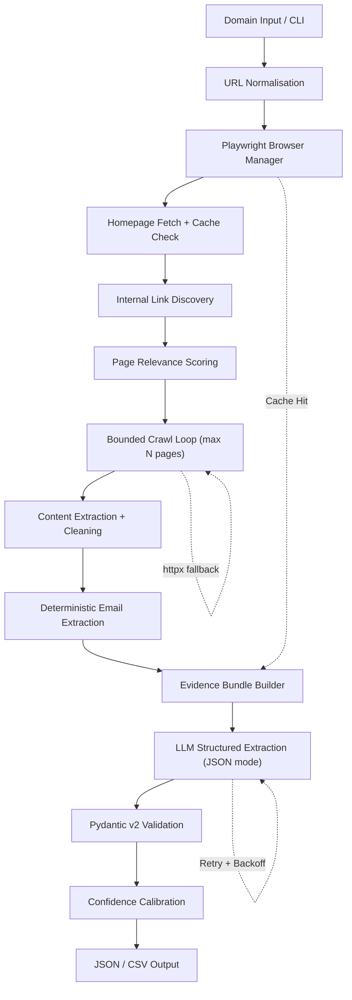

# Autonomous Lead Enrichment Agent

> A production-quality, modular Python pipeline that autonomously crawls company websites, extracts structured intelligence using an LLM, and produces validated JSON output — with no hardcoded company-specific logic.

[](https://www.python.org/)
[](https://docs.pydantic.dev/)
[](https://playwright.dev/)

---

## Table of Contents

- [Project Overview](#project-overview)
- [Architecture & UML Diagrams](#architecture--uml-diagrams)
- [Features](#features)
- [Setup](#setup)
- [Usage](#usage)
- [Output Format](#output-format)
- [Confidence Scoring](#confidence-scoring)
- [Architecture Decisions](#architecture-decisions)
- [Limitations](#limitations)
- [Future Improvements](#future-improvements)
- [Responsible Crawling](#responsible-crawling)
- [Full UML Diagrams Specification (docs/UML_DIAGRAMS.md)](docs/UML_DIAGRAMS.md)

---

## Project Overview

This agent accepts a list of company domains, navigates their public websites using a real browser, discovers and prioritises relevant pages, extracts clean content, and uses an OpenAI LLM to generate structured company intelligence.

The output includes:

- **Company overview** (grounded in crawled evidence — never hallucinated)
- **Ideal customer profile** (inferred from explicit website copy)
- **Contact emails** (deterministically extracted before the LLM is called)
- **Leadership team** (names, titles, LinkedIn URLs — only when evidenced)
- **Confidence score** (calibrated from objective crawl signals)
- **Source attribution** (every fact traceable to a URL)
- **Token/cost tracking** (for LLM budget monitoring)

---

## Architecture & UML Diagrams
 
> 📘 **Full UML Specification**: For the complete suite of UML models (Component, Class, Sequence, Activity, State Machine, and Deployment diagrams), see [docs/UML_DIAGRAMS.md](docs/UML_DIAGRAMS.md).



### Module Map

```
app/
├── config.py              # Pydantic-settings env config
├── main.py                # CLI entry point (argparse)
│
├── models/
│   └── company.py         # Pydantic v2 data models
│
├── browser/
│   └── browser_manager.py # Playwright async context manager
│
├── crawler/
│   ├── crawler.py         # Page fetcher (browser + httpx fallback)
│   ├── discovery.py       # Link scoring and prioritisation
│   └── url_utils.py       # URL normalisation and filtering
│
├── extraction/
│   ├── content.py         # HTML → clean text
│   ├── contacts.py        # Deterministic email extraction
│   └── links.py           # Anchor link discovery
│
├── llm/
│   ├── extractor.py       # OpenAI structured extraction
│   └── search.py          # Optional search provider abstraction
│
├── pipeline/
│   ├── enrichment.py      # Domain pipeline orchestrator
│   ├── confidence.py      # Confidence score calibration
│   └── output.py          # JSON / CSV serialisation
│
├── resilience/
│   └── retry.py           # Error taxonomy + tenacity decorators
│
└── utils/
    ├── cache.py           # Local file-based page cache
    ├── hashing.py         # URL/content hash helpers
    └── logging.py         # Structured logging setup
```

---

## Features

| Feature | Details |
|---|---|
| **Playwright browsing** | Real Chromium browser handles React/Next.js/Vue SPAs |
| **Dynamic content** | Waits for DOM + networkidle; no brittle arbitrary sleeps |
| **Content cleaning** | Removes scripts, styles, SVG, navbars, cookie banners |
| **URL prioritisation** | Scores every discovered link before crawling |
| **Email extraction** | Regex + `mailto:` DOM scan — no LLM hallucination |
| **Structured LLM output** | OpenAI JSON mode + Pydantic validation |
| **Anti-hallucination** | Explicit prompt: "use only supplied evidence" |
| **Resilience** | Bounded exponential-backoff retries via `tenacity` |
| **Caching** | Local file cache keyed by URL hash with TTL |
| **Concurrency** | `asyncio.Semaphore` controls parallel domain processing |
| **Source attribution** | Every extracted fact links back to a source URL |
| **Cost tracking** | Input/output tokens and estimated USD cost per run |
| **Partial results** | Every domain always returns a valid schema object |
| **Optional search** | Pluggable search provider (Tavily) for supplementary data |

---

## Setup

### 1. Clone and create a virtual environment

```bash
git clone https://github.com/your-username/lead-enrichment-agent.git
cd lead-enrichment-agent

# Windows
python -m venv .venv
.venv\Scripts\activate

# macOS / Linux
python3 -m venv .venv
source .venv/bin/activate
```

### 2. Install dependencies

```bash
pip install -r requirements.txt
```

### 3. Install Playwright browser

```bash
playwright install chromium
```

### 4. Configure environment variables

```bash
# Windows
copy .env.example .env

# macOS / Linux
cp .env.example .env
```

Open `.env` and set your OpenAI API key:

```
OPENAI_API_KEY=sk-your-actual-key-here
```

All other settings have safe defaults. See `.env.example` for the full list.

---

## Usage

### Enrich from an input file

```bash
python -m app.main --input data/input.json
```

### Enrich specific domains directly

```bash
python -m app.main --domains postman.com supabase.com vapi.ai
```

### Custom output path and format

```bash
python -m app.main --input data/input.json --output results/enriched.json
python -m app.main --input data/input.json --output results/enriched.csv --output-format csv
```

### Additional options

```bash
python -m app.main --input data/input.json \
  --output data/output.json \
  --log-level DEBUG \
  --max-pages 6 \
  --no-cache
```

### Run tests

```bash
pytest tests/ -v
```

### Example terminal output

```
15:30:01 INFO     | Lead Enrichment Agent starting
15:30:01 INFO     | Model: gpt-4o-mini | Max pages/domain: 8
15:30:01 INFO     | Domains to process: postman.com, supabase.com, vapi.ai

============================================================
Starting enrichment for postman.com
============================================================
15:30:03 INFO     | [postman.com] Homepage loaded (via browser)
15:30:04 INFO     | [postman.com] Discovered 94 internal links
15:30:04 INFO     | [postman.com] Selected 21 relevant candidate pages
15:30:09 INFO     | [postman.com] Crawled: https://postman.com/pricing (score=70)
15:30:11 INFO     | [postman.com] Crawled: https://postman.com/about (score=85)
...
15:30:18 INFO     | [postman.com] Found 2 public email(s)
15:30:18 INFO     | [postman.com] Evidence bundle: 31,420 chars from 6 page(s)
15:30:18 INFO     | [postman.com] Sending evidence to LLM (31420 chars)
15:30:21 INFO     | [postman.com] Structured extraction successful (confidence=0.85)
15:30:21 INFO     | [postman.com] Completed in 20.3s | confidence=0.85 | emails=2 | leaders=3

============================================================
  ENRICHMENT COMPLETE
============================================================
  Processed:           3
  Successful:          3
  Partial:             0
  Failed:              0
  Total pages visited: 18
  Total duration:      64.7s
  Total tokens used:   12,840
  Estimated cost:      $0.0034 USD
  Output:              data/output.json
============================================================
```

---

## Output Format

```json
[
  {
    "domain": "postman.com",
    "company_overview": "Postman is an API platform that enables developers and organizations to design, test, document, and collaborate on APIs. It serves over 30 million developers and 500,000 organizations worldwide.",
    "ideal_customer_profile": "Software development teams and enterprises that build, test, and maintain APIs at scale — particularly those requiring collaborative API workflows, automated testing pipelines, and centralized API governance.",
    "contact_emails": [
      "security@postman.com"
    ],
    "leadership": [
      {
        "name": "Abhinav Asthana",
        "title": "Co-founder & CEO",
        "linkedin_url": null,
        "source_url": "https://postman.com/about"
      }
    ],
    "confidence_score": 0.852,
    "sources": [
      {
        "url": "https://postman.com/about",
        "page_title": "About Postman",
        "relevant_excerpt": "Postman is an API platform for building and using APIs..."
      }
    ],
    "crawl_metadata": {
      "pages_attempted": 7,
      "pages_successful": 6,
      "pages_failed": 1,
      "extraction_timestamp": "2025-06-01T10:30:21Z",
      "duration_seconds": 20.3,
      "errors": ["Timeout loading /team"]
    },
    "llm_usage": {
      "model": "gpt-4o-mini",
      "input_tokens": 3842,
      "output_tokens": 412,
      "total_tokens": 4254,
      "estimated_cost_usd": 0.000824
    },
    "pipeline_errors": [],
    "status": "success"
  }
]
```

---

## Confidence Scoring

The confidence score is **never solely determined by the LLM**. It's computed as a weighted blend of objective signals (80%) and the LLM's self-assessment (20%).

| Signal | Points |
|---|---|
| Homepage retrieved | +0.20 |
| ≥3 pages crawled | +0.15 |
| Company overview populated (>50 chars) | +0.20 |
| ICP populated (>30 chars) | +0.15 |
| Emails found | +0.10 |
| Leadership found | +0.10 |
| ≥3 leaders found | +0.05 |
| ≥3 source pages | +0.05 |
| Crawl failure rate | −up to 0.15 |

**Bands:**
- `0.9–1.0` — Strong multi-page evidence; most fields populated
- `0.7–0.89` — Good evidence; some fields missing
- `0.4–0.69` — Partial evidence; significant gaps
- `0.0–0.39` — Poor or failed crawl

---

## Architecture Decisions

### Why Playwright instead of requests/httpx?
Modern company websites (React, Next.js, Vue) render content client-side via JavaScript. A plain HTTP client receives only the shell HTML — content like team pages, pricing, and about sections may be entirely absent. Playwright runs a real browser, ensuring the rendered DOM is captured.

### Why clean HTML before sending to the LLM?
Raw HTML typically contains 100–500 KB of scripts, styles, tracking pixels, navigation bars, and cookie banners — none of which is useful for intelligence extraction. Sending raw HTML to the LLM would: (a) waste tokens, (b) increase cost, (c) exceed context limits, and (d) confuse the model with noise. The content cleaner reduces pages to 2–10 KB of high-signal text.

### Why deterministic email extraction before the LLM?
Emails are perfectly extractable with regex and DOM traversal. Asking an LLM to "find the email" introduces hallucination risk (it may invent `contact@company.com` based on training data) and wastes tokens. Deterministic extraction is faster, cheaper, and more reliable.

### Why bounded crawling (max N pages)?
Crawling an entire website is unnecessary, slow, and rude to the server. The scoring system identifies the 6–8 most relevant pages (about, team, pricing, contact) that contain 90%+ of the intelligence we need. This keeps the pipeline fast and polite.

### Why tenacity for retries?
`tenacity` provides composable, well-tested retry logic with exponential backoff, jitter, and clean integration with async code. Rolling custom retry loops would introduce subtle bugs around cancellation and exception handling.

---

## Limitations

- **Bot protection**: Sites using Cloudflare, Akamai, or similar systems may block the crawler. The pipeline records the failure and continues to the next domain.
- **Login-gated content**: Information behind authentication (e.g., LinkedIn profiles, private team pages) is inaccessible and not fabricated.
- **LinkedIn URLs**: Only returned when the URL literally appears in the crawled DOM. Not inferred or constructed.
- **Dynamic anti-bot**: Sites that require mouse movement, CAPTCHA, or browser fingerprint checks may not be fully crawlable.
- **Incomplete public information**: If a company publishes minimal content on their website, the enrichment will reflect that honestly (low confidence score).

---

## Future Improvements

- **Optional search provider**: Tavily integration is already architectured in — enable with `SEARCH_PROVIDER=tavily`
- **Distributed crawling**: Replace `asyncio.Semaphore` with a Celery/RQ task queue for hundreds of domains
- **Database storage**: Swap `output.py` JSON writer for a SQLAlchemy adapter
- **Redis cache**: Replace the file-based cache with Redis for multi-process deployments
- **browser-use / LangGraph**: For more complex multi-step agentic navigation
- **Additional enrichment**: LinkedIn Sales Navigator, Clearbit, Apollo.io API adapters

---

## Responsible Crawling

This tool is designed for **public website information only**. It:

- Respects configured crawl limits (`MAX_PAGES_PER_DOMAIN`)
- Adds a polite delay between requests (`CRAWL_DELAY_SECONDS`)
- Does **not** attempt to bypass CAPTCHA, authentication, or anti-bot protections
- Does **not** crawl external or third-party domains
- Records failures honestly rather than fabricating data
- Never executes arbitrary JavaScript from scraped content

If a website is inaccessible, the failure is logged and processing continues with the next domain.