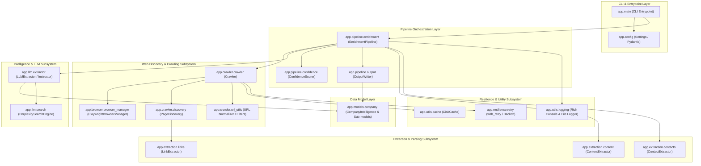
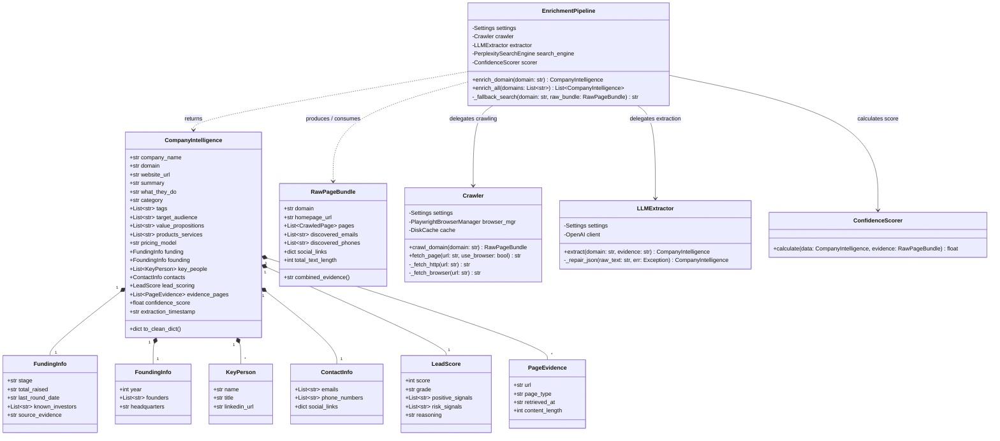
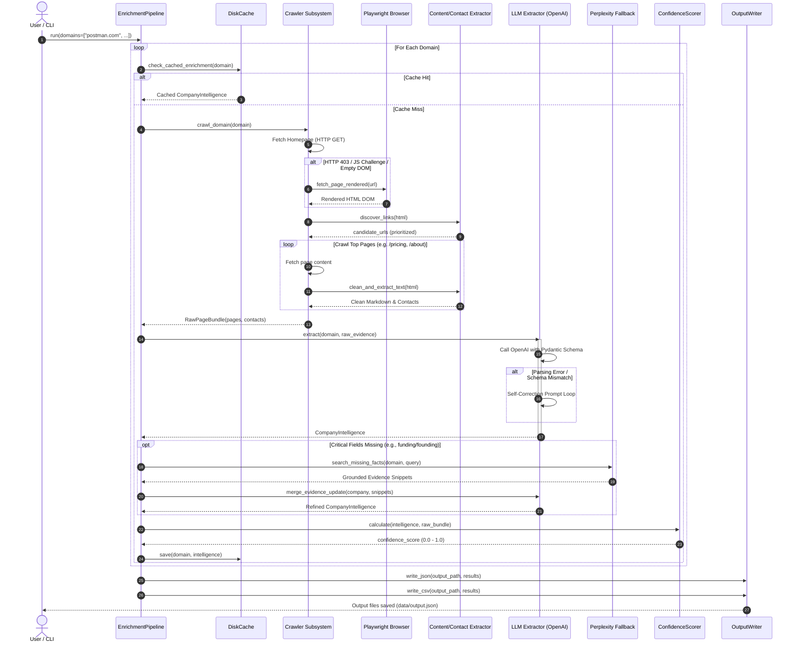
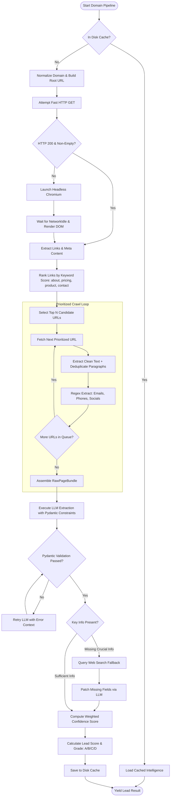
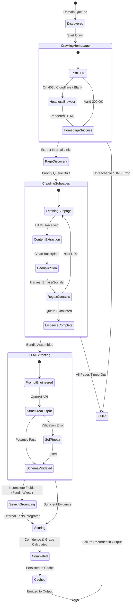
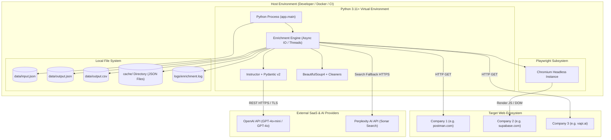

# SoftwareBrio — Comprehensive UML Diagrams Specification

This document provides a full suite of **Unified Modeling Language (UML)** specifications for the Autonomous Lead Enrichment Pipeline. All diagrams are rendered using standard Mermaid UML syntax supported directly by GitHub markdown.

---

## Table of Contents
1. [Component Diagram (System Architecture)](#1-component-diagram-system-architecture)
2. [Class Diagram (Core Domain & Pipeline Classes)](#2-class-diagram-core-domain--pipeline-classes)
3. [Sequence Diagram (End-to-End Execution Flow)](#3-sequence-diagram-end-to-end-execution-flow)
4. [Activity Diagram (Crawler & Enrichment Logic)](#4-activity-diagram-crawler--enrichment-logic)
5. [State Machine Diagram (Lead Processing Lifecycle)](#5-state-machine-diagram-lead-processing-lifecycle)
6. [Deployment Diagram (Runtime Environment & External Sinks)](#6-deployment-diagram-runtime-environment--external-sinks)

---

## 1. Component Diagram (System Architecture)

Illustrates the modular subsystems, interfaces, and dependencies across the application.

---

## 2. Class Diagram (Core Domain & Pipeline Classes)

Details the object-oriented structure, attributes, methods, and relationships.

---

## 3. Sequence Diagram (End-to-End Execution Flow)

Depicts message exchanges and chronological invocations across components.

---

## 4. Activity Diagram (Crawler & Enrichment Logic)

Illustrates the step-by-step branching, error-handling, and decision logic.

---

## 5. State Machine Diagram (Lead Processing Lifecycle)

Tracks the operational state transitions of a domain target during processing.

---

## 6. Deployment Diagram (Runtime Environment & External Sinks)

Shows the deployment topology, runtime processes, storage targets, and external third-party APIs.

